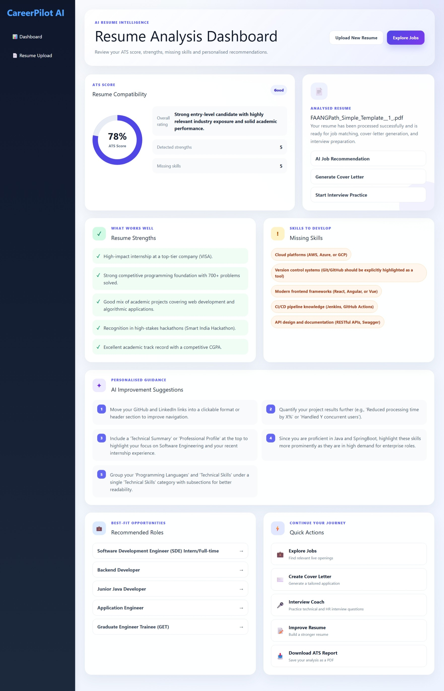
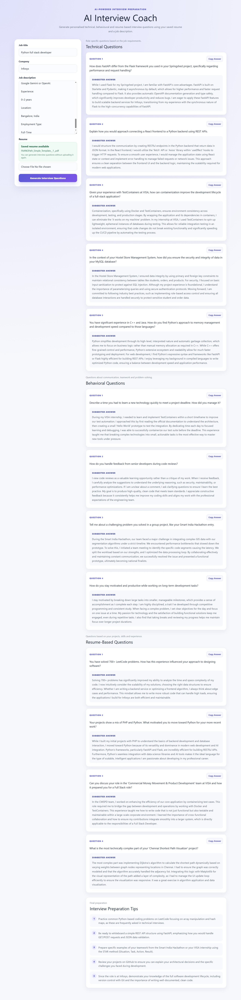
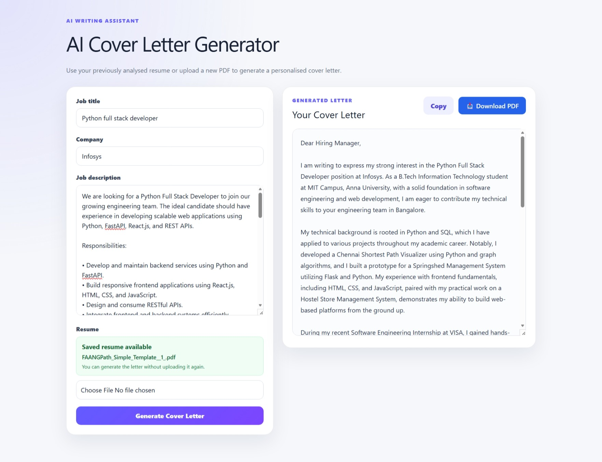

# CareerPilot AI

CareerPilot AI is an AI-powered career assistant designed to help job seekers improve their resumes, evaluate ATS compatibility, prepare for interviews, generate cover letters, and discover relevant job opportunities.

## Features

- ATS resume score and analysis
- Resume strengths and missing-skills detection
- AI-powered resume improvement
- Resume and job-description matching
- Cover letter generation
- AI interview coach
- Resume builder
- Live job search
- ATS report PDF export
- Cover letter PDF export
- Resume text caching for faster reuse

## Screenshots

### Landing Page


### Resume Analyzer


### Dashboard



### Interview Coach



### Cover Letter Generator



## Tech Stack

### Frontend

- React
- Vite
- JavaScript
- CSS
- Axios
- React Router

### Backend

- Python
- FastAPI
- Uvicorn
- Google Gemini API
- PDF text extraction

### Development Tools

- Git
- GitHub
- Visual Studio Code
- Swagger UI
- Postman

## Project Structure

```text
CareerPilotAI/
├── backend/
│   ├── routes/
│   ├── services/
│   └── app.py
├── frontend/
│   ├── src/
│   │   ├── components/
│   │   ├── pages/
│   │   └── services/
│   └── package.json
├── screenshots/
├── README.md
└── .gitignore
```

## Installation

### Clone the repository

```bash
git clone https://github.com/yokiii-25/CareerPilotAI.git
cd CareerPilotAI
```

## Backend Setup

Open a terminal inside the backend folder:

```bash
cd backend
```

Create a virtual environment:

```bash
python -m venv venv
```

Activate it on Windows:

```bash
venv\Scripts\activate
```

Install dependencies:

```bash
pip install -r requirements.txt
```

Create a `.env` file inside the backend folder:

```env
GEMINI_API_KEY=your_google_gemini_api_key
```

Run the backend:

```bash
uvicorn app:app --reload
```

The backend will run at:

```text
http://127.0.0.1:8000
```

Swagger documentation:

```text
http://127.0.0.1:8000/docs
```

## Frontend Setup

Open another terminal:

```bash
cd frontend
```

Install dependencies:

```bash
npm install
```

Run the frontend:

```bash
npm run dev
```

The frontend will run at:

```text
http://localhost:5173
```

## Environment Variables

Never upload API keys or secrets to GitHub.

Example backend `.env`:

```env
GEMINI_API_KEY=your_google_gemini_api_key
```

## Future Roadmap

- User authentication
- User profiles and analysis history
- MongoDB integration
- Interview answer evaluation
- Interview questions PDF export
- Resume templates
- Improved job recommendations
- Cloud deployment
- Mobile-responsive improvements

## Version

Current release:

```text
v1.0.0
```

## Author

Developed by [Yogeshwara](https://github.com/yokiii-25)

## License

This project is intended for educational and portfolio purposes.